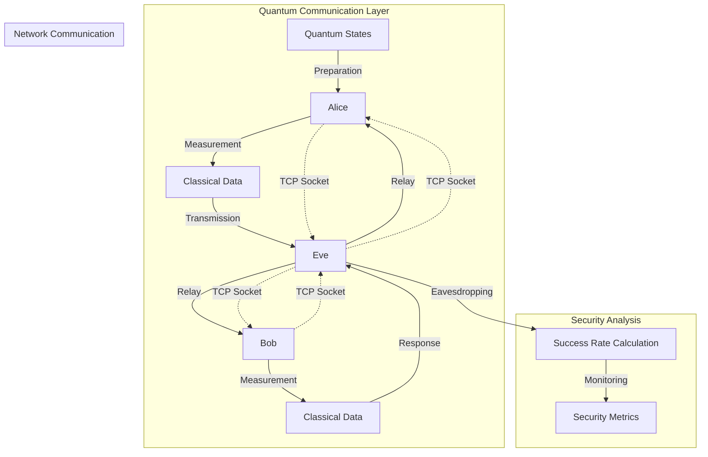
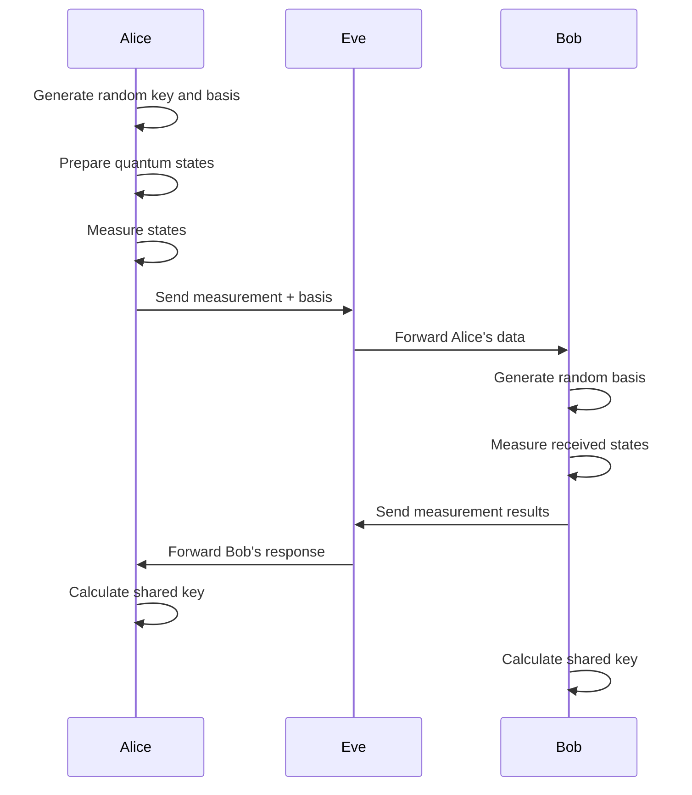
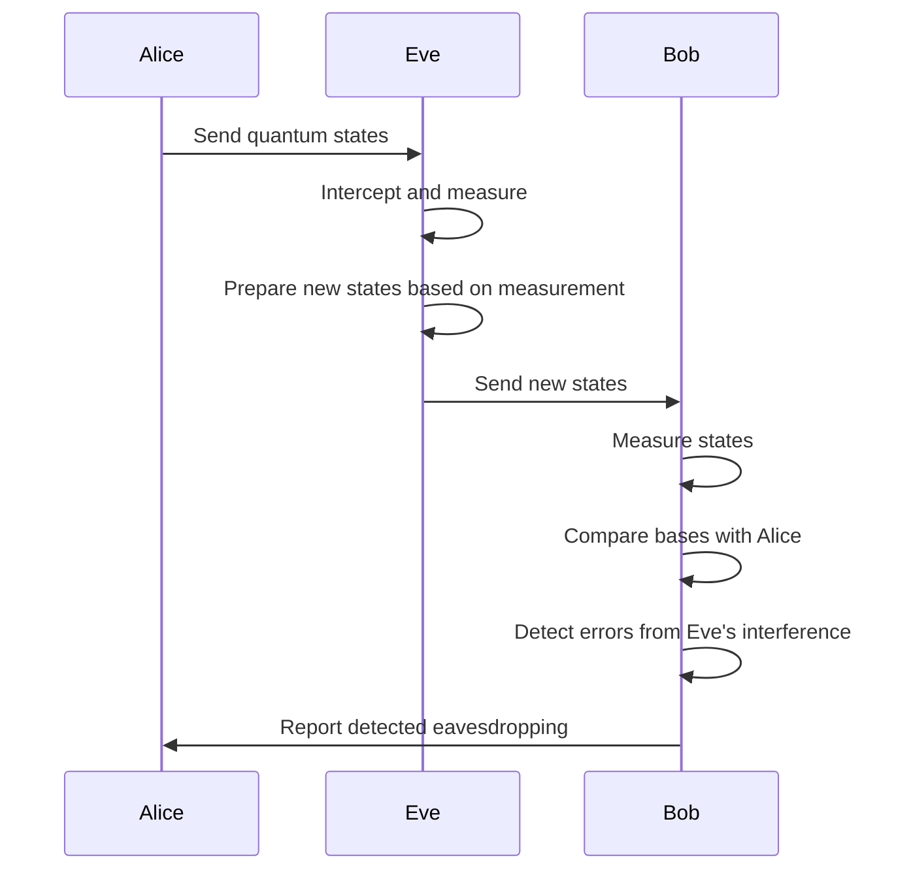

# QKD-BB84 Quantum Key Distribution Simulation

This project implements a simulation of the BB84 quantum key distribution protocol with three nodes: Alice (sender), Bob (receiver), and Eve (eavesdropper). The simulation demonstrates how quantum mechanics can be used to detect eavesdropping in secure communication.

## Overview

The BB84 protocol is a quantum key distribution scheme developed by Charles Bennett and Gilles Brassard in 1984. It uses quantum mechanics principles to allow two parties to produce a shared random secret key known only to them, which can then be used to encrypt and decrypt messages.

## Project Structure

```
QKD-BB84-Alice-Bob-Eve/
├── alice2.py    # Alice node - key sender
├── bob2.py      # Bob node - key receiver  
├── eve2.py      # Eve node - eavesdropper
└── README.md    # This file
```

## Components

### Alice (`alice2.py`)
- **Role**: Key sender and quantum state preparer
- **Functionality**:
  - Generates random quantum states (qubits) using two different bases (rectilinear and diagonal)
  - Encodes classical bits into quantum states
  - Measures the prepared states
  - Sends measurement results and basis information to Eve

### Bob (`bob2.py`) 
- **Role**: Key receiver and quantum state measurer
- **Functionality**:
  - Listens for incoming connections from Eve
  - Receives Alice's measurement data and basis information
  - Generates his own random measurement basis
  - Measures the quantum states using his basis
  - Sends his measurement results back to Eve

### Eve (`eve2.py`)
- **Role**: Eavesdropper and communication relay
- **Functionality**:
  - Acts as a man-in-the-middle between Alice and Bob
  - Receives Alice's data and forwards it to Bob
  - Receives Bob's response and forwards it back to Alice
  - Attempts to intercept and guess the shared key
  - Tracks and calculates eavesdropping success rate

## High-Level Architecture



## Sequence Diagram

### Normal Operation (Alice to Bob via Eve)



### Eavesdropping Detection



## Protocol Flow

1. **Key Generation**: Alice generates a random bit string and chooses random bases for each bit
2. **State Preparation**: Alice encodes bits into quantum states using her chosen bases
3. **Transmission**: Alice sends the quantum states to Bob via Eve
4. **Measurement**: Bob measures the states using his own random bases
5. **Basis Comparison**: Alice and Bob publicly compare their bases (not the bit values)
6. **Key Sifting**: They keep only the bits where their bases matched
7. **Eavesdropping Detection**: Any eavesdropping by Eve introduces errors that can be detected

## Installation Requirements

```bash
pip install qiskit qiskit-aer
```

## Usage

### Starting the Simulation

**Important**: Start the nodes in the following order:

1. **Bob** (Server - listens for connections)
   ```bash
   python bob2.py
   ```

2. **Eve** (Relay - connects to Bob and waits for Alice)
   ```bash
   python eve2.py
   ```

3. **Alice** (Client - connects to Eve)
   ```bash
   python alice2.py
   ```

### Port Configuration

- **Bob**: Listens on `localhost:65435`
- **Eve**: Listens on `localhost:65434`, connects to Bob on `localhost:65435`
- **Alice**: Connects to Eve on `localhost:65434`

## Security Features

### Eavesdropping Detection

The simulation demonstrates how quantum mechanics enables eavesdropping detection:

- **No-Cloning Theorem**: Eve cannot copy unknown quantum states
- **Measurement Disturbance**: Any measurement by Eve disturbs the quantum states
- **Error Rate**: Alice and Bob can detect Eve by comparing a subset of their key bits

### Success Rate Monitoring

Eve's eavesdropping success rate is tracked and displayed:
- Shows the percentage of successful key interceptions
- Demonstrates the inherent security of quantum communication

## Technical Implementation

### Quantum Circuit Operations

- **X Gate**: Flips qubit state |0⟩ to |1⟩ or |1⟩ to |0⟩
- **H Gate**: Creates superposition states (diagonal basis)
- **Measurement**: Collapses quantum states to classical bits

### Network Communication

- Uses TCP sockets for reliable communication
- JSON-like string formatting for data exchange
- Error handling for network failures

## Expected Output

When running the simulation, you should see output similar to:

```
Bob is listening for connections...
Connected to Eve from ('127.0.0.1', 54321)
Alice's measurement: [0, 1, 0, 1, 1, 0, 1, 0, 0, 1, 1, 0]
Alice's data sent to Eve.
Bob received Alice's data: [0, 1, 0, 1, 1, 0, 1, 0, 0, 1, 1, 0], [1, 0, 1, 0, 1, 0, 1, 0, 1, 0, 1, 0]
Bob's measurement: [0, 1, 0, 1, 1, 0, 1, 0, 0, 1, 1, 0]
Message sent to Eve: [0, 1, 0, 1, 1, 0, 1, 0, 0, 1, 1, 0]
Iteration: 1, Eve's success rate: 0.00000%
```

## Troubleshooting

### Common Issues

1. **Connection Refused**: Ensure nodes are started in the correct order
2. **Port Already in Use**: Check for existing processes using the required ports
3. **Import Errors**: Verify Qiskit and Qiskit-Aer are properly installed

