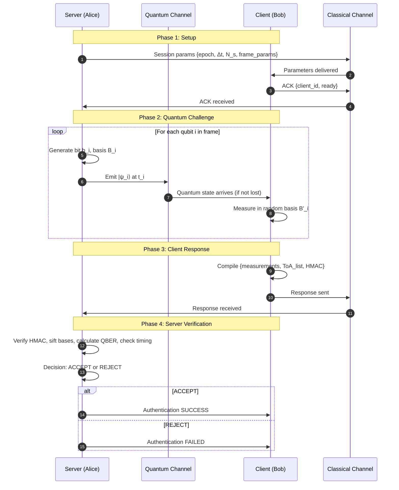
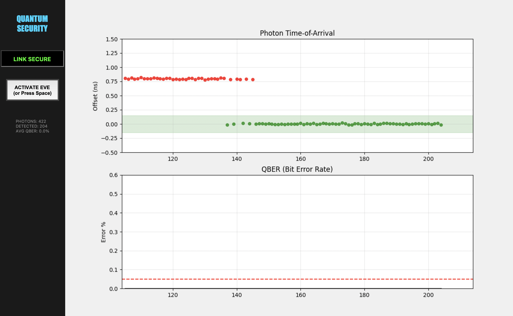
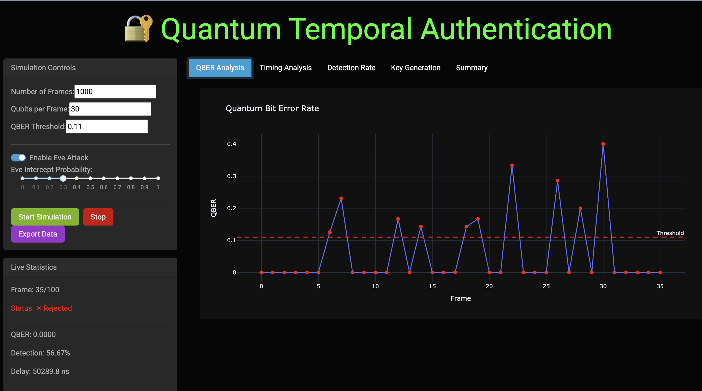

# Quantum Temporal Authentication (QTA)

## Briefing on Quantum Temporal Authentication (QTA)

### Executive Summary

Quantum Temporal Authentication (QTA) is an emerging security protocol that grounds identity verification in the physical principles of quantum mechanics and precise timing. Unlike traditional cryptographic methods that rely on mathematical complexity, QTA validates an entity by its ability to measure and respond to quantum signals within strictly defined, nanosecond-scale time windows. This approach fundamentally resists attacks from both classical and quantum computers.

The security of QTA is derived from two core concepts: **Temporal Binding**, where any interception or manipulation of a quantum signal introduces detectable timing delays, and the **Quantum No-Cloning Theorem**, which makes it physically impossible for an attacker to duplicate a quantum state for a replay attack without disturbing it.

This document outlines a comprehensive framework for QTA, detailing its protocol specification, operational flow, and security advantages. Key applications include high-assurance identity verification for critical infrastructure, satellite-to-ground communications, and augmenting quantum-resistant Public Key Infrastructure (PKI). Furthermore, a detailed risk and threat model is presented, alongside a practical plan for operational monitoring using the Zeek network analysis framework to integrate QTA events into Security Information and Event Management (SIEM) and Cybersecurity Bill of Materials (CBOM) systems.

## Comparative Analysis: QTA vs. QKD and Classical Methods

| Aspect | QTA (Quantum Temporal Authentication) | QKD (Quantum Key Distribution) | Classical TOTP / FIDO2 |
|--------|--------------------------------------|-------------------------------|-----------------------|
| Primary Purpose | Identity/authentication bound to time & quantum state | Shared secret/key distribution | Authentication (knowledge/possession/biometrics) |
| Physical Requirement | Quantum transmitter & precise ToA measurement | Quantum channel with key distillation | Classical channel, TOTP server or FIDO device |
| Temporal Sensitivity | Critical (Δt defines security) | Important (but not core to key secrecy) | Low (NTP for time sync) |
| Resistance to Quantum Computers | Physical — high resistance | Physical — high resistance | Depends on underlying algorithm (PQC needed) |
| Replay Protection | Strong — nonce + timing makes replay infeasible | Strong — decoy states & privacy amplification | TOTP limited time window; FIDO2 uses counters/challenge |
| Man-in-the-Middle Risk | Low if Δt & quantum stats checked | Low if QBER monitored | Higher unless TLS + PKI/PQC used |
| Infrastructure Cost | Moderate–high (quantum optics + sync) | High (full QKD stack + key management) | Low (software tokens, hardware keys) |
| Deployability | Good for high-value links | Mature for niche fiber/satellite links | Universal, easy |
| Time to Compromise | Immediate detection possible | Immediate detection often possible | Depends on algorithm/key strength |
| Best Use Case | High-assurance auth where timing matters | Long-term secure key distribution | General web / consumer authentication |

## The Foundations of Quantum Temporal Authentication (QTA)

### Definition and Core Principles

QTA is a security protocol where a user or device proves its identity by demonstrating possession of a time-dependent quantum property. Authentication is successful only when an expected quantum state is measured and verified within a precise time window, carrying the correct quantum correlations. The protocol integrates quantum states (such as single photons or entangled pairs), strict time-of-arrival constraints, and a classical side-channel for verification.

Its efficacy rests on three foundational ideas:

- **Temporal Binding**: Authentication is only considered valid if the quantum signal arrives within a nanosecond-scale temporal slot. This leverages the short-lived nature of quantum coherence and the fact that any attempt by an adversary to intercept, measure, and resend a signal will inevitably introduce a detectable delay or statistical noise.

- **Quantum No-Cloning**: The quantum no-cloning theorem guarantees that an unknown quantum state cannot be perfectly duplicated. This physical limitation prevents attackers from creating copies of quantum states for replay or impersonation attacks. Any attempt to intercept the state inherently disturbs its properties (e.g., polarization, phase), making the attack detectable.

- **Time-Correlated Quantum Challenges**: A server issues "Q-challenges" encoded in qubits or weak coherent pulses at specific times. The client must return a valid response within a strict temporal budget, proving its ability to receive and measure the states in real-time. Any deviation beyond the allowed time window (Δt) is a criterion for rejection.

### Security Advantages

QTA offers inherent resistance to a range of sophisticated cyber threats by shifting the security basis from computational difficulty to physical laws.

| Threat | Why QTA Resists |
|--------|-----------------|
| Replay Attacks | Rendered infeasible by the combination of strict timing constraints and the impossibility of cloning quantum states. |
| Man-in-the-Middle (MITM) | Any interception fundamentally alters the quantum state and its arrival time, which are both checked during verification. |
| Quantum Computer Brute-Force | Authentication relies on the timely arrival of physical signals, not on solving a mathematical problem vulnerable to quantum algorithms. |
| Key Leakage | Q-challenges are ephemeral, used for a single authentication event, and never reused. |
| Side-Channel Timing Bypass | The challenge schedule is fixed but incorporates quantum randomness, making it difficult to predict or bypass. |

### Key Use Cases

The unique properties of QTA make it suitable for high-assurance security applications, including:

- Zero-trust identity verification in quantum-ready networks.
- Satellite-to-ground station authentication, where timing advantages are significant.
- Access control for critical infrastructure (energy grids, telecommunications, defense systems).
- High-assurance authentication for Internet of Things (IoT) devices using quantum random optical components.
- Augmentation for quantum-resistant Public Key Infrastructure (PKI).

## QTA Protocol Specification

### Actors and Assumptions

The protocol involves three primary actors and operates on a set of core assumptions:

**Actors:**

- **Server (S)**: Issues quantum challenges, timestamps events, and verifies client responses.
- **Client (C)**: Receives quantum states, performs measurements, and replies on a classical channel.
- **Clock Sync Authority**: An optional entity or process (e.g., GPS, PTP) that ensures sub-nanosecond time alignment between the Server and Client.

**Assumptions and Primitives:**

- A quantum source, such as weak-coherent pulses (WCP) or a true single-photon source.
- Time-of-arrival (ToA) measurement resolution in the picosecond range (practically 10–100 ps).
- An authenticated classical channel (e.g., TLS) for negotiating parameters.
- A defined Quantum Bit Error Rate (QBER) threshold, typically ≤ 3–6%.
- A strict timing window (Δt), such as ±50 ps for short fiber links or ±1–10 ns for satellite paths.

### High-Level Message Flow

A typical QTA session follows a structured four-stage process:

1. **Setup / Parameter Exchange**: The Server and Client use the authenticated classical channel to exchange session parameters, including the epoch ID, timing window (Δt), frame parameters (e.g., pulses per frame), a public 128-bit nonce (N_s), and the maximum allowed QBER.

2. **Quantum Challenge (Q-challenge)**: The Server emits a frame of quantum states (q_i) at precisely timed intervals (t_i). Each state encodes a randomly chosen basis and bit value, which are not revealed over the classical channel.

3. **Client Measurement & Immediate Response**: The Client measures each incoming quantum state (q_i) within the approved timing window. It then composes a classical response message containing the measurement outcomes, the measured time-of-arrival for each detection, and an authenticity tag (e.g., HMAC). This response must be sent back before a final frame deadline.

4. **Server Verification**: The Server verifies the authenticity of the response and checks it for correctness. It compares the client's measurement outcomes with the expected values, confirms that detections fell within the |ToA_i − t_i| ≤ Δt window, and calculates the QBER. If all metrics are within predefined thresholds, authentication is successful.



### Protocol Parameters and Variants

The protocol's performance and security can be tuned using various parameters.

| Parameter | Example Baseline |
|-----------|------------------|
| Frame Duration | 1 ms |
| Pulses per Frame | 1024 |
| Mean Photon Number (μ) | 0.1 (if using WCP) |
| Basis Set | {Z, X} or Polarization {H,V,D,A} |
| Authentication Score | ≥ 0.95 (fraction of correct outcomes in Δt) |
| Allowed Channel Loss | Up to 25–30 dB |
| Timing Sync Method | GPS / WhiteRabbit / PTP |
| Replay Nonce Lifetime | Single Frame (non-reused) |

**Protocol Variants:**

- **Entanglement-based QTA**: The Server and Client share entangled pairs. The Client measures its half at specified times and returns results for correlation checks by the Server.
- **Challenge-Response with Delayed Basis Reveal**: The Server withholds the basis information until after the Client's response arrives, reducing an attacker's advantage.
- **Hybrid Classical-Quantum**: The quantum channel is used for short burst authentication to bootstrap a longer session protected by classical Post-Quantum Cryptography (PQC).

## Risk, Threat, and Mitigation Model

### Assets and Attack Surfaces

A comprehensive threat model for QTA must consider the assets being protected and the surfaces vulnerable to attack.

**Protected Assets:**

- The authentication decision (accept/reject).
- Session keys derived from a successful authentication.
- Clock synchronization data.
- Device identity metadata.

**Attack Surfaces:**

- **Quantum Channel**: Intercept-resend (MITM), photon-number splitting, loss injection, and delay attacks.
- **Classical Channel**: Replay of classical responses, tampering with parameter exchange, compromise of authentication keys (e.g., HMAC/TLS).
- **Device Level**: Compromised detectors (blinding), side-channel leakage, fault injection, and supply-chain vulnerabilities.

### Threat Analysis and PQC Integration

The primary goal of an attacker is to spoof a client's identity. This can be achieved by either (A) forging the classical response and its timing or (B) intercepting quantum states without detectable disturbance.

Vector (A) is mitigated by using PQC-signed parameter exchanges, short nonce lifetimes, and hardware security modules (HSMs).

Vector (B) is prevented by the fundamental principles of quantum no-cloning, strict Δt checks, and decoy-state methods to detect photon-number splitting.

**Post-Quantum Cryptography (PQC) Integration**: While QTA's core security is physical, it does not eliminate the need for classical cryptography. The classical channel used for parameter negotiation must be protected by PQC algorithms (e.g., CRYSTALS-DILITHIUM/Kyber) to ensure long-term security against quantum adversaries. QTA reduces reliance on algorithmic secrecy for the authentication itself but requires PQC to secure the surrounding protocol infrastructure.

### Controls and Mitigations

A multi-layered defense strategy is essential for a robust QTA implementation.

- **Temporal Controls**: Strict Δt windows, diversified ToA checks, and jitter randomness in timing slots.
- **Quantum Controls**: Decoy-state methods, entanglement tests, and randomness tests on photon statistics.
- **Classical Controls**: PQC-signed parameter exchanges, FIPS-like key protection, and short nonce lifetimes.
- **Device Hardening**: Detector watchdogs, tamper detection, secure boot, and supply-chain attestations via a CBOM.
- **Monitoring**: Continuous collection of ToA histograms, QBER trends, and photon counts, integrated into a SIEM.


# Python Implementations

## Frameworks Comparison

| Framework | NumPy   | SimPy | QuNetSim | NetSquid | Qiskit  |
|-----------|---------|-------|----------|----------|---------|
| For QTA?  | ✓ YES   | PARTIAL | ✓ YES    | ✓ YES    | ✗ NO    |
| Install   | ⭐⭐⭐⭐⭐ | ⭐⭐⭐⭐⭐ | ⭐⭐⭐⭐   | ⭐⭐     | ⭐⭐⭐⭐   |
| Speed     | ⚡⚡⚡⚡⚡ | ⚡⚡⚡⚡  | ⚡⚡⚡    | ⚡⚡⚡    | ⚡⚡     |
| Learning  | Easy    | Easy  | Medium   | Hard     | Medium   |
| Cost      | Free    | Free  | Free     | License  | Free     |
| Score     | 8/10    | 6/10  | 9/10     | 9/10     | 4/10     |


### 1. NumPy-Based QTA Simulator
**Code:** 1.qta_numpy.py  
**Screenshot:**  
**Description:** Fast vectorized QTA simulation using NumPy for efficient computation, featuring real-time GUI visualization of photon arrival times, QBER analysis, and attacker interception scenarios with spacebar toggle.

### 2. SimPy-Based QTA Simulator
**Code:** 2.qta_SimPy.py  
**Screenshot:**  
**Description:** Discrete-event simulation of QTA using SimPy library, modeling quantum communication timing, fiber delays, and attacker interference with interactive keyboard controls.

### 3. Quanetsim-Inspired QTA Simulator
**Code:** 3.qta_qunetsim.py  
**Screenshot:**  
**Description:** Comprehensive QTA simulator mimicking Quanetsim, implementing detailed quantum physics including channel loss, decoy states, timing constraints, and GUI-based monitoring with live attack toggling.

### 4a. NetSquid-Compatible QTA Simulator (needs registeration at: netsquid.org))
**Code:** 4.qta_netsquid_org.py    
**Description:** Advanced QTA simulator attempting NetSquid integration (with fallback), featuring decoy state protocols, error correction, and web-based dashboard for interactive quantum key distribution analysis.

### 4b. NetSquid-Compatible QTA Simulator (Simulation)
**Code:** 4.qta_netsquid_sim.py  
**Screenshot:**  
**Description:** Production-ready QTA implementation with custom quantum backend, implementing realistic channel physics, decoy states, post-processing, and interactive web interface for security metrics monitoring.

### 5. Qiskit-Based QTA Simulator
**Code:** 5.qta_qiskit.py  
**Screenshot:**  
**Description:** Circuit-based QTA simulation using Qiskit, demonstrating quantum authentication through measurable qubits with Eve attack modeling, real-time Dash visualization, and statistical analysis.

## Operational Monitoring and Integration with Zeek

To ensure operational integrity, QTA deployments require robust monitoring to detect anomalies in real-time. The Zeek network monitoring framework can be used to parse classical control messages and generate security events.

### Log Schema for qta_event

A unified JSON log format, `qta_event`, can capture the essential metrics of each authentication frame for analysis in a SIEM or CBOM system.

Example `qta_event` Fields:

```json
{
  "ts": "2025-11-16T12:34:56.789Z",
  "frame_id": "epoch-20251116-0001",
  "server_id": "S-01",
  "client_id": "C-42",
  "event_type": "frame_verification",
  "pulses_sent": 1024,
  "detections_in_window": 982,
  "qber": 0.023,
  "mean_delay_ps": 42.7,
  "auth_result": "ACCEPT",
  "failure_reasons": [],
  "detector_status": {
    "firmware_hash": "sha256:..."
  },
  "firmware_supply_chain": {
    "vendor": "OptiQ",
    "cbom_id": "CBOM-UUID"
  }
}
```

### Zeek's Role in Anomaly Detection

Zeek can be deployed on the classical management network to inspect QTA control messages. Custom scripts can parse these messages to:

- Extract `qta_event` data and log it in a structured format.
- Generate real-time notices for anomalies, such as a QBER exceeding a predefined threshold (e.g., >5%).
- Implement heuristics to detect specific attacks, like detector blinding (e.g., an unnaturally high detection rate combined with very low delay and QBER).

### Integration with SIEM and CBOM

The structured logs generated by Zeek are forwarded to a SIEM for correlation and dashboarding. This enables monitoring of key trends like QBER over time, mean delay distributions, and authentication failure rates.

**CBOM Integration**: Each quantum device's CBOM entry should contain its firmware hash. When a `qta_event` log shows a `firmware_hash` that mismatches the one in the CBOM, a high-priority alert is triggered. This can initiate an automated workflow to quarantine the device and flag a potential supply-chain compromise.

**Alerting Thresholds:**

- **QBER > 5%**: Warning
- **Mean Delay increase > 3σ**: Warning
- **Repeated Auth Rejects (> 5 in 10 mins)**: Lock device


## QTA Simulation Parameters Summary

## 1. Simulation Parameters

| Parameter                  | Default Value   | Range        | Description                                           | Impact                                 |
|:---------------------------|:----------------|:-------------|:------------------------------------------------------|:---------------------------------------|
| Number of Frames           | 100-200         | 10 - 500     | Total number of authentication frames to simulate     | Statistical accuracy, computation time |
| Qubits per Frame           | 20-30           | 5 - 50       | Number of qubits transmitted per authentication frame | Key generation rate, QBER accuracy     |
| Frame Interval             | 50 ms           | 10 - 1000 ms | Time interval between consecutive frames              | Real-time behavior, system load        |
| Simulation Duration (est.) | 5-10 seconds    | Variable     | Total time to complete simulation                     | User experience, resource usage        |

---

## 2. Physical Channel Parameters

| Parameter           | Default Value   | Typical Range   | Description                                  | Physical Basis                        |
|:--------------------|:----------------|:----------------|:---------------------------------------------|:--------------------------------------|
| Channel Length      | 10 km           | 1 - 100 km      | Physical distance between Alice and Bob      | Network topology                      |
| Fiber Loss          | 0.2 dB/km       | 0.1 - 0.5 dB/km | Optical fiber attenuation coefficient        | Beer-Lambert law, Rayleigh scattering |
| Detector Efficiency | 0.7 (70%)       | 0.3 - 0.9       | Probability of photon detection when present | Detector quantum efficiency           |
| Dark Count Rate     | 1e-6            | 1e-7 - 1e-5     | Rate of false detection events               | Thermal noise, detector imperfections |
| Timing Jitter       | 50 ps           | 10 - 200 ps     | Random variation in detection timing         | Electronics timing uncertainty        |
| Propagation Delay   | ~5 μs/km        | Fixed by c      | Speed of light propagation in fiber          | Refractive index (~1.5 for fiber)     |

---

## 3. Temporal Authentication Parameters

| Parameter                   | Default Value   | Typical Range   | Description                               | Security Impact                          |
|:----------------------------|:----------------|:----------------|:------------------------------------------|:-----------------------------------------|
| Expected Delay              | 50 ns (base)    | 10 - 1000 ns    | Baseline expected detection time          | Baseline for anomaly detection           |
| Timing Window               | ±100 ns         | ±10 - 500 ns    | Acceptable variation in detection timing  | False positive/negative rate             |
| Delay Measurement Precision | ~1 ns           | 0.1 - 10 ns     | Resolution of timing measurements         | Attack detection sensitivity             |
| Time Synchronization        | Assumed perfect | ±1 ps - 1 μs    | Clock synchronization between Alice & Bob | Critical for timing-based authentication |

---

## 4. Security Thresholds

| Threshold                   | Default Value   | Critical Range   | Meaning                              | Security Implication                                   |
|:----------------------------|:----------------|:-----------------|:-------------------------------------|:-------------------------------------------------------|
| QBER Threshold              | 11%             | 0-15%            | Maximum acceptable bit error rate    | Above 11%: Likely Eve attack or channel degradation    |
| Minimum Detection Rate      | 25%             | 10-50%           | Minimum qubits that must be detected | Below threshold: Insufficient data for authentication  |
| Maximum Loss Rate           | 75%             | 0-90%            | Maximum acceptable photon loss       | Above limit: Channel too lossy for secure operation    |
| Timing Violation Limit      | 0               | 0-5%             | Number of allowed timing anomalies   | Non-zero: Possible timing attack or delay manipulation |
| Authentication Success Rate | >80%            | 50-100%          | Overall authentication reliability   | Below 80%: System unreliable, possible attack          |

---

## 5. Attack Parameters

| Attack Type             | Eve Intercept Probability   | Added Delay   | QBER Impact   | Detection Method     | Implementation Status   |
|:------------------------|:----------------------------|:--------------|:--------------|:---------------------|:------------------------|
| Intercept-Resend        | 0-100%                      | 100-1000 ns   | ~25% (high)   | QBER + Timing        | ✓ Implemented           |
| Photon Number Splitting | Depends on intensity        | Minimal       | Low (<5%)     | Decoy states         | ○ Planned               |
| Beam Splitting          | 0-50%                       | Minimal       | Medium (~10%) | Statistical analysis | ○ Planned               |
| Timing Attack           | N/A                         | Variable      | Minimal       | Timing analysis      | ✓ Implemented           |
| Trojan Horse            | Equipment dependent         | Minimal       | Low           | Equipment inspection | ○ Future                |

---

## 6. Decoy State Parameters

| Intensity Level   | Mean Photon Number   | Probability   | Purpose              | Expected QBER     |
|:------------------|:---------------------|:--------------|:---------------------|:------------------|
| Signal            | 0.5 (μ)              | 50%           | Key generation       | Normal (~3-5%)    |
| Decoy 1           | 0.3                  | 30%           | PNS attack detection | Similar to signal |
| Decoy 2           | 0.1                  | 15%           | PNS attack detection | Similar to signal |
| Vacuum            | 0.0                  | 5%            | Baseline measurement | Only dark counts  |

---

## 7. Error Correction & Privacy Amplification

| Technique                       | Efficiency   | Communication Overhead   | Security Impact              | Implementation   |
|:--------------------------------|:-------------|:-------------------------|:-----------------------------|:-----------------|
| Error Correction (Cascade)      | ~1.15-1.22   | High                     | Corrects natural errors      | ○ Simplified     |
| Error Correction (LDPC)         | ~1.05-1.10   | Medium                   | Corrects natural errors      | ○ Simplified     |
| Privacy Amplification           | Variable     | Low                      | Removes Eve's information    | ✓ Estimated      |
| Two-way Classical Communication | N/A          | Required                 | Enables error reconciliation | ✓ Simulated      |
| Hash Function                   | N/A          | Minimal                  | Final key compression        | ○ Planned        |

---

## 8. Key Generation Metrics

| Metric                    | Formula/Method                                 | Typical Value   | Units                | Depends On                        |
|:--------------------------|:-----------------------------------------------|:----------------|:---------------------|:----------------------------------|
| Raw Key Rate              | Detection_rate × Qubits_per_frame × Frame_rate | 5-20 bits/frame | bits/frame or bits/s | Detection rate, frame rate        |
| Sifted Key Rate           | Raw_rate × Basis_match_prob (50%)              | 2-10 bits/frame | bits/frame or bits/s | Basis matching, detection rate    |
| Secure Key Rate           | Sifted_rate × (1 - 2×H(QBER))                  | 1-5 bits/frame  | bits/frame or bits/s | QBER, error correction efficiency |
| Key Generation Efficiency | Secure_rate / Raw_rate                         | 20-50%          | Dimensionless ratio  | All above factors                 |

---

## 9. Quantum Backend Options

| Backend              | Realism     | Speed   | Installation       | Best For                     | Current Status                |
|:---------------------|:------------|:--------|:-------------------|:-----------------------------|:------------------------------|
| Custom (Pure Python) | Medium      | Fast    | None required      | Quick prototyping, education | ✓ Implemented                 |
| NetSquid             | High        | Medium  | Complex            | Realistic network simulation | ○ Removed (dependency issues) |
| Qiskit               | Medium-High | Slow    | pip install qiskit | Gate-based simulation        | ○ Available (not default)     |
| QuTiP                | High        | Slow    | pip install qutip  | Open quantum systems         | ○ Potential addition          |
| Cirq                 | Medium      | Medium  | pip install cirq   | Google quantum hardware      | ○ Potential addition          |

---

## 10. Visualization Options

| Visualization       | Type            | Key Information                              | Use Case                          | Interactive   |
|:--------------------|:----------------|:---------------------------------------------|:----------------------------------|:--------------|
| QBER vs Time        | Scatter + Line  | Error rate, threshold, authentication status | Attack detection, channel quality | ✓ Yes         |
| Timing Analysis     | Dual subplot    | Average delay, violations, anomalies         | Timing attack detection           | ✓ Yes         |
| Detection Rate      | Area chart      | Photon detection efficiency                  | Channel loss analysis             | ✓ Yes         |
| Key Generation Rate | Cumulative line | Cumulative secure bits generated             | Key generation performance        | ✓ Yes         |
| Summary Statistics  | Cards + Table   | Overall performance metrics                  | Overall system assessment         | ✓ Yes         |

---

## 11. Authentication Decision Logic

| Criterion               | Condition                   | Default Threshold   | Failure Consequence                | Recommended Action               |
|:------------------------|:----------------------------|:--------------------|:-----------------------------------|:---------------------------------|
| QBER Check              | QBER ≤ Threshold            | ≤ 11%               | Reject frame (high error)          | Check channel, look for Eve      |
| Timing Check            | Timing_violations = 0       | 0 violations        | Reject frame (timing attack)       | Investigate timing anomalies     |
| Detection Rate Check    | Detection_rate ≥ Min_rate   | ≥ 25%               | Reject frame (insufficient data)   | Check detectors, channel loss    |
| Statistical Consistency | Additional tests (optional) | Custom              | Reject frame (statistical anomaly) | Investigate statistical patterns |
| Final Decision          | ALL checks must pass        | AND logic           | Authentication FAILED              | Abort session, alert operator    |

---

## 12. Performance Metrics

| Metric                      | Target Value   | Actual (Typical)   | Measurement Method                        | Critical For            |
|:----------------------------|:---------------|:-------------------|:------------------------------------------|:------------------------|
| Authentication Success Rate | >90%           | 85-95%             | Successful authentications / Total frames | System reliability      |
| False Positive Rate         | <5%            | 2-8%               | False alarms / Total authentic frames     | Usability, false alarms |
| False Negative Rate         | <1%            | 0.5-2%             | Missed attacks / Total attack frames      | Security                |
| Attack Detection Rate       | >95%           | 90-98%             | Detected attacks / Total attack frames    | Security                |
| Key Generation Rate         | >1 bit/frame   | 0.5-3 bits/frame   | Average secure bits per frame             | Practical utility       |
| Simulation Speed            | >10 frames/sec | 5-20 frames/sec    | Frames processed per second               | Real-time operation     |
| Resource Usage              | <500 MB RAM    | 100-300 MB         | Memory profiling                          | Scalability             |

---

## 13. Configuration Presets

| Preset               | Channel Length   | Fiber Loss   |   Detector Efficiency | Eve Attack    |   Frames | Expected Success Rate   |
|:---------------------|:-----------------|:-------------|----------------------:|:--------------|---------:|:------------------------|
| Laboratory (Ideal)   | 1-5 km           | 0.1 dB/km    |                  0.9  | Off           |      500 | ~98%                    |
| Metropolitan Network | 10-30 km         | 0.2 dB/km    |                  0.7  | 20% intercept |      200 | ~90%                    |
| Long Distance        | 50-100 km        | 0.3 dB/km    |                  0.5  | 10% intercept |      100 | ~70%                    |
| High Security        | 10 km            | 0.2 dB/km    |                  0.8  | 50% intercept |      300 | ~50% (with attacks)     |
| Fast Demo            | 5 km             | 0.15 dB/km   |                  0.75 | 30% intercept |       50 | ~95%                    |

---
