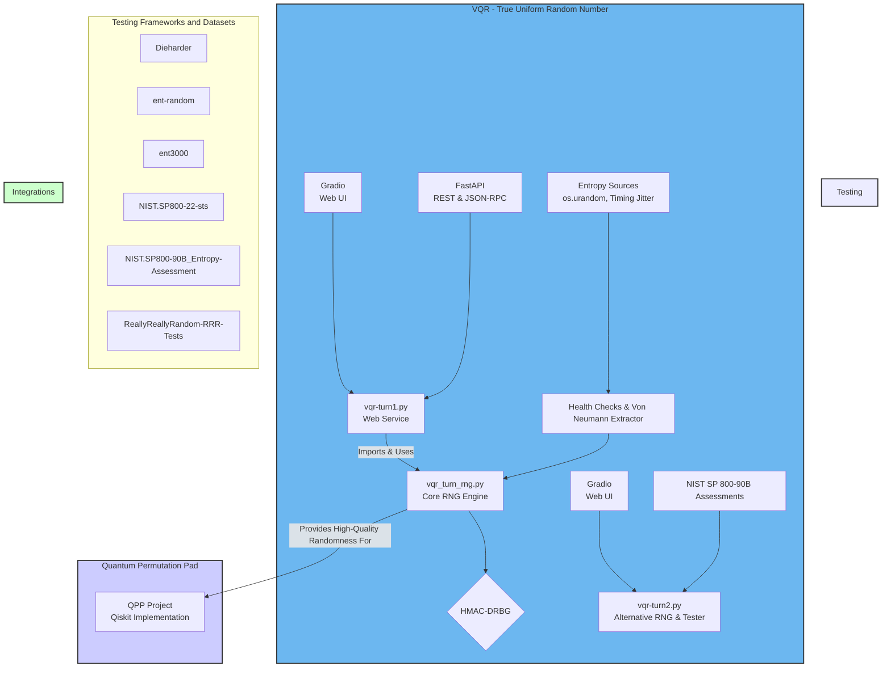

# Virtual Quantum Reality (VQR) & Quantum Privacy Preserving (QPP)

These repo reviews many **True-Radnomness-Tests** related documents from NIST (National Institute of Standards and Technology) and Dieharder describe  **statistical test suites for evaluating the randomness of number generators** . Both sources detail various **tests designed to detect patterns or biases** in binary sequences that would indicate a lack of true randomness. The NIST document,  **Special Publication 800-22** , presents  **15 specific tests** , including the Frequency (Monobit) Test and the Serial Test, along with their mathematical backgrounds and guidelines for interpretation. It also introduces the concepts of  **random number generators (RNGs) and pseudorandom number generators (PRNGs)** , emphasizing their importance in cryptographic applications and the need to minimize Type II errors (falsely accepting a non-random sequence as random). The **Special Publication 800-90B** focuses on **entropy sources** for random bit generation, outlining **health tests and statistical methods for estimating min-entropy** to ensure the quality of these sources. The Dieharder excerpts highlight its role as an  **extended methodology for randomness testing** , building upon earlier test suites like Diehard, and includes examples of good (mt19937) and bad (randu, slatec) generators, emphasizing the use of **p-values and the Kolmogorov-Smirnov test** for evaluating results.

This repository also hosts two distinct but related projects: **Virtual Quantum Reality (VQR) – True Uniform Random Number (TURN)**, which explores methods for generating high-quality random numbers in software, and **Quantum Privacy Preserving (QPP)**, which provides implementations of a quantum cryptographic primitive using Qiskit.

# Random Number Generator (RNG) Testing and Dieharder Suite

## 1. Introduction to Randomness and RNGs

**The Fundamental Problem with Random Numbers:**

* "The fundamental problem is that it is not possible to generate truly random numbers by means of any mathematical algorithm. The very term 'random number generator' (RNG) is a mathematical or computational oxymoron." (DieHarder)
* Even physical processes, including quantum experiments, present a challenge in definitively proving true randomness versus unpredictability due to entropy or a lack of complete system knowledge.
* The distinction between "unpredictable" and "random" is crucial: an event can be unpredictable due to insufficient data (entropy), but not truly random.

**Types of Random Number Generators:**

* **True Random Number Generators (RNGs):** Utilize non-deterministic physical sources (entropy sources) and a "distillation process" to produce randomness. Examples include thermal noise, user input timing, or quantum effects. These outputs must satisfy "strict randomness criteria as measured by statistical tests." (NIST SP 800-22)
* **Pseudorandom Number Generators (PRNGs):** Are deterministic algorithms that take a random "seed" as input and generate a sequence of "pseudorandom" numbers. "In contexts in which unpredictability is needed, the seed itself must be random and unpredictable. Hence, by default, a PRNG should obtain its seeds from the outputs of an RNG." (NIST SP 800-22)
* PRNGs are often preferred for generating large quantities of random numbers efficiently, and "ironically, pseudorandom numbers often appear to be more random than random numbers obtained from physical sources." (NIST SP 800-22)

**Importance of Random Numbers:**

* Critical in various computational contexts:
* **Monte Carlo simulations:** For sampling large phase spaces.
* **Games:** To ensure unique and unbiased experiences.
* **Cryptography:** As the "fundamental basis or sine qua non of Internet commerce." (DieHarder)
* **Mathematics and Statistics:** For theoretical and applied contexts.

**Challenges in RNG Design and Use:**

* **Periodicity:** Older generators often had short periods, leading to repeated sequences in long simulations.
* **High-Dimensional Correlations:** Many generators produce numbers with subtle patterns only visible in high-dimensional spaces, requiring a large number of samples to detect.
* **Bit-Level Randomness:** Many generators may have "bad bits" that do not change value, impacting uniformity, especially in least significant bits.

## 2. Statistical Testing of RNGs: Core Concepts and Methodologies

**Purpose of RNG Testing:**

* To provide a "suite of tests, as systematic as possible, to which 'random number generators' of all sorts can be subjected." (DieHarder)
* To detect deviations from expected properties of a truly random sequence.
* To minimize the probability of a Type II error – "accepting a sequence being produced by a generator as good when the generator was actually bad." (NIST SP 800-22)

**The Null Hypothesis (H0):**

* The fundamental assumption in most tests is that the sequence being tested is random.
* "If the P-value is very, very low (say, less than 10^-6) then we are pretty safe in rejecting the null hypothesis and concluding that the RNG is 'bad'." (DieHarder)
* A high P-value (e.g., > 0.01) "is insufficient evidence to reject the null hypothesis, but it is also insufficient to cause us to accept the null hypothesis as proven." (DieHarder)
* "The null hypothesis, by its nature, can never be proven to be true, it can only fail to be observed to fail." (DieHarder)

**P-values and the Kolmogorov-Smirnov (KS) Test:**

* **Single Trial P-value:** A single P-value from a test often provides limited information.
* **Distribution of P-values:** To overcome the limitations of single P-values, "a Kolmogorov-Smirnov (KS) test is applied to the p-values observed to determine the probability of obtaining them in a random sampling of a uniform distribution." (DieHarder) This is itself a P-value, but it applies to the entire series of independent trials.
* **Uniformity of P-values:** For a truly random generator, the P-values from many independent runs of a test should be uniformly distributed across the range [0, 1). A non-uniform distribution (e.g., clustering near 0 or 1) indicates a problem with the RNG.
* **Anderson-Darling KS Test:** Often used for its sensitivity in evaluating the uniformity of P-value distributions.
* **Test Histograms:** Provide a visual aid for human judgment, making it "easy to see why the p-value of a test series is small." (DieHarder)

**Types of Errors in Testing:**

* **Type I Error (α):** The probability of "falsely rejecting the null hypothesis," i.e., concluding a sequence is non-random when it is, in fact, random. This is the "level of significance," typically chosen as 0.01 or 0.05. (NIST SP 800-22)
* **Type II Error (β):** The probability that the test will "indicate that the sequence is random when it is not; that is, a 'bad' generator produced a sequence that appears to have random properties." (NIST SP 800-22) Unlike α, β is not a fixed value and is harder to calculate. The goal is to minimize β.

## 3. Key RNG Test Suites

**A. Diehard:**

* **Origin:** Developed by George Marsaglia, it has a strong reputation for testing subtle non-randomness from bit-sequence to uniform deviate distributions.
* **Weaknesses (addressed by Dieharder):** Limited tests for bit-level randomness and cryptographic strength (addressed by NIST STS).
* Lack of parametric variability; treated as a "benchmark" rather than an exploratory tool.
* Many tests lacked a concluding KS test on the distribution of p-values, leading to ambiguous results.
* Often used partially overlapping sequences, which are not truly independent.
* Ambiguous licensing of the original code.

**B. NIST Statistical Test Suite (STS) SP 800-22:**

* **Purpose:** Developed by NIST to extend Diehard's methodology, focusing on bit-level randomness for cryptographic applications.
* **Number of Tests:** Consists of 15 tests (e.g., Frequency, Runs, Binary Matrix Rank, Discrete Fourier Transform, Universal Statistical, Linear Complexity, Serial, Approximate Entropy, Cumulative Sums, Random Excursions, Random Excursions Variant).
* **Key Design Principles:Unpredictability:** Essential for cryptographic applications.
* **Scalability:** Tests should apply to subsequences.
* **Consistency:** Generator behavior should be consistent across seeds.
* **Interpretation of Results:** NIST adopted two approaches:

1. **Proportion of Sequences Passing:** The percentage of tested sequences that yield a P-value ≥ α. A confidence interval is used to determine if the proportion is acceptable.
2. **Uniform Distribution of P-values:** Visually examined with histograms and quantitatively assessed with a $\chi^2$ test on the P-values themselves.

* **Current Status (Critical Review):** "Clearly Obsolete, Possibly Harmful" (NIST.SP800-22 Tests is Obsolete.pdf) for cryptographic applications.
* It is "no longer used in NIST’s own Deterministic Random Bit Generator (DRBG) and Entropy Source validation processes." (NIST.SP800-22 Tests is Obsolete.pdf) FIPS 140-3 requires more robust SP 800-90A and SP 800-90B standards.
* The tests are based on a purely statistical interpretation, not "computational indistinguishability" or "cryptanalytic security notions." (NIST.SP800-22 Tests is Obsolete.pdf)
* Weak PRNGs can easily pass these tests, creating "false confidence in insecure systems." (NIST.SP800-22 Tests is Obsolete.pdf)
* Reference generators in SP 800-22 "pass these tests while generally lacking security," demonstrating the pitfalls of black-box statistical testing. (NIST.SP800-22 Tests is Obsolete.pdf)

**C. Dieharder:**

* **Motivation:** Developed to address the weaknesses of Diehard and extend the capabilities of RNG testing.
* **Key Features and Improvements over Diehard:KS Test for all tests:** "All Dieharder Diehard tests have an outcome based on a single p-value from a KS test of the uniformity of many p-values returned by individual runs of each basic test." (DieHarder)
* **Adjustable Parameters:** Controls the number of individual test runs (default 100), and for many tests, the number of samples per test. This allows "parametric exploration" and "systematically improving the resolution and discrimination" of tests. (DieHarder)
* **Visual Histograms:** Provided for P-value distributions to aid human judgment.
* **Modular Test Structure:** Makes it easy to create new tests and maintain existing ones.
* **Rewritten Code:** "Completely rewritten in well-commented C without direct reference to or the inclusion of either the original fortran code or any of the various attempted C ports of that code." (DieHarder)
* **Open Source (GPL):** "anyone in the world can use it, resell it, modify it, or extend it." (DieHarder) This provides transparency and allows for community contributions and debugging.
* **GSL Integration:** Built on the Gnu Scientific Library (GSL) for efficient, robust mathematical routines and a wide range of prebuilt RNGs.
* **Long Sequence Testing:** Designed to test "very long sequences" (e.g., 10^18 random numbers), addressing a limitation of Diehard. (Robert G. Brown's General Tools Page.pdf)
* **Extensibility:** Intended to incorporate all Diehard, NIST STS, Knuth tests, and new contributions, becoming "the 'Swiss army knife of random number test suites'." (Robert G. Brown's General Tools Page.pdf)
* **Timing Harness:** Allows measurement of RNG speed, balancing "speed of a RNG... and their quality." (DieHarder)

## 4. Specific Dieharder Tests and Examples

**A. New Dieharder Tests:**

* **Timing Test:** Returns random numbers per second.
* **Bit Persistence Test:** Checks for bits that do not change value across many samples. A "surprising number of early RNGs fail this test." (DieHarder)
* **Bit Distribution Test:** A "systematic series of tests" that examines n-tuples of bits within a long stream, incrementing frequency counters for each n-bit integer. It's hierarchically related, meaning passing for n implies passing for n' < n. This test "subsumes both STS monobit and STS runs." (DieHarder)

**B. Examples of RNG Performance (from Dieharder):**

* **mt19937_1999 (Good Generator):** Fast (28x10^7 rands/second).
* Bit persistence test: "PASSED (no bits repeat)".
* Bit distribution test: "it is 5-bit random... but 6 bit chunks are not uniformly distributed." This is crucial information, indicating its limits.
* Passed most Diehard tests, though some (like Birthdays) were "marginal" and would fail with increased sampling.
* Binary rank tests were "less sensitive to overt inhomogeneity in the ntuple bit distribution than the bit distribution test."
* Passed parking lot and minimum distance tests (2D/3D), suggesting reasonable uniformity through three dimensions.
* Passed squeeze, sums, runs, and craps tests.
* **randu (Bad Generator):** Fast (39x10^7 rands/second).
* Bit persistence test: "FAILED (bits repeat)", with two least significant bits never changing.
* Bit distribution test: "It is not even 1 bit random," meaning "produces an unbalanced number of 0’s and 1’s." This leads to cascading failures in other tests, like STS Runs Test.
* "a pretty poor generator that might well not even produce a zero-sum coin flip game." (DieHarder)
* **slatec (Ugly Generator):** Similar speed to mt19937_1999.
* "has only 22 bits in the numbers it returns."
* "fails to be even 1-bit random."
* "proceeds to fail all of the tests for randomness!"
* "unsuitable for any purpose – except, of course, demonstrating the unambiguous failure of an RNG test in Dieharder." (DieHarder)

## 5. Modern Perspectives and Future Directions in RNG Testing

**Critiques of Traditional Black-Box Testing (SP 800-22):**

* Predates modern cryptography and information theory.
* Focuses on statistical properties rather than "computational indistinguishability" or cryptographic security.
* Fails to consider "how hard it is to 'break' the random and pseudorandom generators." (NIST.SP800-22 Tests is Obsolete.pdf)
* Can lead to "false confidence" in insecure systems because even weak generators can pass.
* Does not adequately address physical and interface security, or the potential for backdoors.

**Key Security Assurance Aspects for Cryptographic RNGs (Modern Standards like SP 800-90 series and AIS-31):**

* **Pseudorandom Generator Evaluation:** Demonstrating (via mathematical proofs) that breaking a DRBG implies breaking an underlying vetted cryptographic algorithm (e.g., AES, SHA-2/3).
* **Pseudorandom Implementation Validation:** Using Known Answer Tests (KATs) with reference vectors and formal methods, rather than statistical tests.
* **Entropy Source Evaluation:** Stochastic modeling of entropy sources to ensure they produce the expected amount of entropy, requiring access to raw noise sources.
* **Physical/Interface Security:** Robust protection from monitoring and interference, with the generator often in the same physical enclosure as other cryptographic components.
* **Resistance to Attacks:Computational Indistinguishability:** Output should be computationally indistinguishable from random.
* **Forward/Backward Secrecy:** Future outputs should not be predictable from past ones, and past outputs should not reveal the seed.
* **Absence of Backdoors/Trapdoors:** Especially public-key trapdoor functions that could allow covert determination of the secret state.
* **Quantum Computing Resistance:** Vulnerability to algorithms like Shor's.

**Future of Dieharder and RNG Testing:**

* **Hierarchical Test Series:** Developing tests like the bit distribution test that "provide very specific information about the degree to which a RNG is random and also provides some specific insight into the nature of its failure." (DieHarder)
* **Microbenchmark Suite:** A set of tests that "all generators fail but that provide specific measures of the point at which randomness fails as they do so." (DieHarder)
* **Application-Level Tests:** To help numerical simulationists and cryptographers rank RNGs for specific application contexts.
* **Visualization of Failures:** Beyond P-values and histograms, visualizing patterns of failure, especially for high-dimensional correlations, can reveal new insights.
* **Community Contribution:** Dieharder is intended to be a "useable testbed framework for researchers to write, and ultimately contribute, their" own tests. (DieHarder)


---

## VQR – True Uniform Randomness (TURN)

### Overview

This project explores the conceptual and practical aspects of generating truly unpredictable and uniform random numbers in software, aiming to mimic quantum randomness without requiring quantum hardware. It leverages techniques like entropy amplification, bias correction, and cryptographic hardening to produce high-quality randomness.

### Architecture Diagram

The following diagram illustrates the architecture of the VQR/TURN project, its components, and its potential integration with the QPP project, as well as the included testing frameworks.



### Core RNG Engine: `vqr_turn_rng.py` Analysis

The `vqr_turn_rng.py` script implements a conceptual **Virtual Quantum Reality / True Uniform Random Number (VQR/TURN)** generator. It is designed as a teaching and demonstration tool, not as a cryptographically secure generator for production use.

The architecture follows a sophisticated multi-stage pipeline to produce high-quality random numbers:

1. **Entropy Collection:**

   * It gathers initial randomness (entropy) from two distinct sources:
     * `os.urandom`: A cryptographically strong source of randomness provided by the operating system.
     * **Timing Jitter:** A custom function (`_timing_jitter_bytes`) that measures the tiny, unpredictable variations in CPU execution time from a tight loop. This mimics a physical entropy source.
2. **Health Checks & Conditioning:**

   * Before use, the raw entropy undergoes online **health checks** to detect potential failures or biases. These include:
     * A **Repetition Count Test** to ensure no long runs of identical bits.
     * An **Adaptive Proportion Test** to verify that the number of 0s and 1s is balanced.
   * The raw data is then passed through a **Von Neumann extractor** (`_von_neumann`), a classic algorithm that removes statistical bias from a bitstream.
   * Finally, the debiased entropy is mixed and condensed into a fixed-size seed using the **SHA3-256** hash function.
3. **Random Number Generation:**

   * The processed seed is used to initialize a **HMAC-DRBG** (Deterministic Random Bit Generator), which is implemented following the style of NIST SP 800-90A, a widely recognized standard.
   * This DRBG is the core engine that expands the initial seed into a long stream of pseudo-random bytes.
4. **Reseeding:**

   * To ensure long-term security and prevent the internal state from becoming stale, the generator automatically **reseeds** itself with fresh entropy after generating a certain amount of data (1 MB by default).
5. **Statistical Validation:**

   * The file also includes utility functions for basic statistical analysis of the output, such as a **Monobit Frequency Test** and a **Chi-Square Uniformity Test**, to provide a sanity check on the quality of the generated random numbers.

### Implementations

There are three Python scripts in this project:

* `vqr_turn_rng.py`: This file contains the core implementation of the VQR/TURN random number generator. For a detailed breakdown, see the [Core RNG Engine Analysis](#core-rng-engine-vqr_turn_rngpy-analysis) section above.
* `vqr-turn1.py`: This script exposes the `VQRTurnRNG` from `vqr_turn_rng.py` as a web service. It uses FastAPI to create REST and JSON-RPC 2.0 endpoints for generating random floats, 64-bit unsigned integers, and bytes. It also provides a simple web interface using Gradio for easy demonstration.
* `vqr-turn2.py`: This file presents an alternative implementation that focuses on generating random bits and testing their quality using the NIST SP 800-90B entropy assessment suite. It also provides a Gradio UI and a FastAPI REST API. This implementation uses Python's standard `random` module for bit generation, which is not cryptographically secure, and is intended for demonstration and testing purposes.

### Installation

To run these scripts, you need to install the required Python packages. You can install them using pip:

```bash
pip install fastapi uvicorn gradio
```

You will also need to compile the C++ NIST SP 800-90B assessment tool. Please see the `NIST.SP800-90B_Entropy-Assessment/README.md` for instructions.

### Usage

You can run each of the `vqr-turn` scripts as follows:

* **`vqr-turn1.py`**: This will start a web server with the Gradio UI and the API.

  ```bash
  python vqr-turn1.py
  ```

  - The FastAPI service will be available at `http://localhost:8000`.
  - The Gradio UI will be available at `http://localhost:7860`.
* **`vqr-turn2.py`**: This script can be run in two modes.

  - To launch the Gradio UI:
    ```bash
    python vqr-turn2.py
    ```
  - To launch the FastAPI API:
    ```bash
    python vqr-turn2.py api
    ```

---

# Entroby Test (ent)

## Statistical Randomness (what ent tested)

### Your file passes basic statistical tests:

1- Entropy ~ 8 bits/byte
2- Balanced distribution across all 256 byte values
3- No correlation between bytes
4- Monte Carlo π estimate close to the real value

### This means the data is indistinguishable from random to simple statistical tools.

1- **Entropy = 7.999994 bits per byte**  The maximum entropy possible for 8-bit data is **8 bits per byte**.  Your file is essentially perfectly random, or at least indistinguishable from random by this test.  Practical meaning: No lossless compression can shrink it further.

2- **Optimum compression = 0%**  Since entropy is already maximal, compression algorithms like gzip or bzip2 would not reduce the size.  The file is already “**incompressible**.”

3- **Chi-square distribution = 222.90 (p ≈ 92.73%)**  The chi-square test checks uniformity of byte distribution **(0–255)**.  A value in the middle range is expected for random data.  Here, the probability that a truly random sequence would produce a higher chi-square is 92.73%, which is still within acceptable randomness expectations.  In short: looks random.

4- **Arithmetic mean = 127.4907 (ideal = 127.5)**  Perfectly balanced between 0–255.  Suggests no bias toward high or low byte values.

5- **Monte Carlo value for Pi = 3.142776116 (error 0.04%)**  ent estimates π by randomly sampling coordinate pairs from the data.  Your result is very close to **true π** (3.14159…), which again indicates strong randomness.

6- **Serial correlation coefficient = 0.000303 (ideal = 0.0)**  Measures how much each byte is correlated with the previous one.  A value near 0 indicates no correlation; your file is essentially uncorrelated.

# Cryptographic Randomness

## Cryptographic randomness is about unpredictability, not just passing statistical tests.

### A weak pseudo-random number generator (PRNG) might pass ent but still be predictable if you know the algorithm/seed.

To call it cryptographically secure, you’d need properties like:
1- Non-determinism (can’t reconstruct the sequence from a partial output)
2- Resistance to backtracking (knowing previous outputs doesn’t reveal future ones)
3- Resistance to prediction (no feasible shortcut better than brute force)

### dieharder-Robert G. Brown

https://webhome.phy.duke.edu/~rgb/General/dieharder.php

https://github.com/seehuhn/dieharder

### Sample Test Results

dieharder -a -f samples.bin
#=============================================================================#

### dieharder version 3.31.1 Copyright 2003 Robert G. Brown

#=============================================================================#
   rng_name    |           filename             |rands/second|
        mt19937|                     samples.bin|  2.14e+08  |
#=============================================================================#
        test_name   |ntup| tsamples |psamples|  p-value |Assessment

| Test Name               | ntup  | tsamples | psamples | p-value       | Assessment |
| ----------------------- | ----- | -------- | -------- | ------------- | ---------- |
| diehard_birthdays       | 0     | 100      | 100      | 0.92921659    | 🟢 PASSED  |
| diehard_operm5          | 0     | 1000000  | 100      | 0.85979285    | 🟢 PASSED  |
| diehard_rank_32x32      | 0     | 40000    | 100      | 0.86845104    | 🟢 PASSED  |
| diehard_rank_6x8        | 0     | 100000   | 100      | 0.47508380    | 🟢 PASSED  |
| diehard_bitstream       | 0     | 2097152  | 100      | 0.20007870    | 🟢 PASSED  |
| diehard_opso            | 0     | 2097152  | 100      | 0.92720025    | 🟢 PASSED  |
| diehard_oqso            | 0     | 2097152  | 100      | 0.97339456    | 🟢 PASSED  |
| diehard_dna             | 0     | 2097152  | 100      | 0.25053825    | 🟢 PASSED  |
| diehard_count_1s_str    | 0     | 256000   | 100      | 0.22948193    | 🟢 PASSED  |
| diehard_count_1s_byt    | 0     | 256000   | 100      | 0.23258425    | 🟢 PASSED  |
| diehard_parking_lot     | 0     | 12000    | 100      | 0.30644186    | 🟢 PASSED  |
| diehard_2dsphere        | 2     | 8000     | 100      | 0.97238648    | 🟢 PASSED  |
| diehard_3dsphere        | 3     | 4000     | 100      | 0.60172815    | 🟢 PASSED  |
| diehard_squeeze         | 0     | 100000   | 100      | 0.10737538    | 🟢 PASSED  |
| diehard_sums            | 0     | 100      | 100      | 0.04916443    | 🟢 PASSED  |
| diehard_runs            | 0     | 100000   | 100      | 0.86049149    | 🟢 PASSED  |
| diehard_runs            | 0     | 100000   | 100      | 0.73462738    | 🟢 PASSED  |
| diehard_craps           | 0     | 200000   | 100      | 0.99974607    | 🟡 WEAK    |
| diehard_craps           | 0     | 200000   | 100      | 0.65448055    | 🟢 PASSED  |
| marsaglia_tsang_gcd     | 0     | 10000000 | 100      | 0.21899736    | 🟢 PASSED  |
| marsaglia_tsang_gcd     | 0     | 10000000 | 100      | 0.99331908    | 🟢 PASSED  |
| sts_monobit             | 1     | 100000   | 100      | 0.52185888    | 🟢 PASSED  |
| sts_runs                | 2     | 100000   | 100      | 0.37388690    | 🟢 PASSED  |
| sts_serial (1–16 runs) | …    | 100000   | 100      | various       | 🟢 PASSED  |
| rgb_bitdist (1–12)     | …    | 100000   | 100      | various       | 🟢 PASSED  |
| rgb_minimum_distance    | 2–5  | 10000    | 1000     | various       | 🟢 PASSED  |
| rgb_permutations        | 2–5  | 100000   | 100      | various       | 🟢 PASSED  |
| rgb_lagged_sum (0–32)  | 0–32 | 1000000  | 100      | various       | 🟢 PASSED  |
| rgb_kstest_test         | 0     | 10000    | 1000     | 0.02450848    | 🟢 PASSED  |
| dab_bytedistrib         | 0     | 51200000 | 1        | 0.67906192    | 🟢 PASSED  |
| dab_dct                 | 256   | 50000    | 1        | 0.04672474    | 🟢 PASSED  |
| dab_filltree (2 runs)   | 32    | 15000000 | 1        | 0.1545/0.3505 | 🟢 PASSED  |
| dab_filltree2 (2 runs)  | 0–1  | 5000000  | 1        | 0.6399/0.5067 | 🟢 PASSED  |
| dab_monobit2            | 12    | 65000000 | 1        | 0.88319991    | 🟢 PASSED  |

## Quantum Privacy Preserving (QPP)

### QPP Overview

This project is forked from: https://github.com/AlainChance/QPP-Alain, and contains companion Jupyter notebooks for Quantum Permutation Pad (QPP) implementations with Qiskit Runtime and Qiskit AerSimulator, ranging from 2 to 9 qubits. It serves as illustrations for the paper: Chancé, A. (2024). Quantum Permutation Pad with Qiskit Runtime. In: Femmam, S., Lorenz, P. (eds). ICCNT 2022. Springer, Cham. https://doi.org/10.1007/978-3-031-59619-3_12

### QPP Directory Structure

The `QPP/` folder contains the implementation of the Quantum Permutation Pad (QPP) with Qiskit Runtime.

* `QPP/Alice`: Contains the code for Alice, the sender, including Jupyter notebooks for agent setup and QPP execution.
* `QPP/Bob`: Contains the code for Bob, the receiver, including Jupyter notebooks for agent setup and QPP execution.
* `QPP/QPP_2_qubits`: Contains the implementation and related files for the 2-qubit QPP.
* `QPP/QPP_4_qubits`: Contains the implementation and related files for the 4-qubit QPP.
* `QPP/QPP_9_qubits`: Contains the implementation and related files for the 9-qubit QPP.
* `QPP/README.md`: Specific documentation for the QPP project.

### QPP Setup and Execution

1. **Set up IBM Cloud account (optional)**: Refer to [this guide](https://quantum.cloud.ibm.com/docs/en/guides/cloud-setup) for details on how to set up your IBM Cloud account on the upgraded IBM Quantum Platform.
2. **Run `Bob_agent.ipynb`**: This notebook starts a receiver agent (uvicorn server) to receive files.
3. **Run `QPP_Alice.ipynb`**: This notebook guides Alice through the QPP setup.
4. **Run `QPP_Bob.ipynb`**: This notebook guides Bob through the decryption process.

For more detailed instructions, please refer to the `QPP/README.md` file.

### References

[1] Kuang, Randy. Quantum Permutation Pad for Quantum Secure Symmetric and Asymmetric Cryptography. Vol. 2, no. 1, Academia Quantum, 2025. https://doi.org/10.20935/AcadQuant7457

[2] I. Burge, M. T. Mai and M. Barbeau, "A Permutation Dispatch Circuit Design for Quantum Permutation Pad Symmetric Encryption," 2024 13th International Conference on Communications, Circuits and Systems (ICCCAS), Xiamen, China, 2024, pp. 35-40, doi: 10.1109/ICCCAS62034.2024.10652827.

[3] Chancé, A. (2024). Quantum Permutation Pad with Qiskit Runtime. In: Femmam, S., Lorenz, P. (eds) Recent Advances in Communication Networks and Embedded Systems. ICCNT 2022. Lecture Notes on Data Engineering and Communications Technologies, vol 205. Springer, Cham. https://doi.org/10.1007/978-3-031-59619-3_12

---

## Testing Frameworks and Datasets

This repository includes several directories containing testing frameworks, datasets, and related documentation for evaluating random number generators:

* **Dieharder/**: Contains files related to the Dieharder suite of statistical tests for random number generators.
* **ent-random/**: Includes the `ent` utility for basic statistical analysis of random data.
* **ent3000/**: Contains Java libraries, likely for entropy assessment or related tasks.
* **NIST.SP800-22-sts/**: Houses the NIST Special Publication 800-22, a statistical test suite for random and pseudorandom number generators for applications in cryptographic systems and information technology.
* **NIST.SP800-90B_Entropy-Assessment/**: Contains tools and data for assessing entropy sources as per NIST SP 800-90B.
* **ReallyReallyRandom-RRR-Tests/**: Includes Python scripts for running various randomness tests, possibly including IID tests.

## Additional Files

* `NIST.SP.800-90B.pdf`: This document contains the NIST SP 800-90B Recommendation for the Entropy Sources Used for Random Bit Generation.
* `Quantum Permutation Pad.pdf`: This PDF provides foundational information about the Quantum Permutation Pad (QPP) concept.
* `Dieharder/dieharder_modified version.pdf`: Information about Dieharder tests.
* `Dieharder/dieharder-Robert G. Brown.pdf`: Documentation related to Robert G. Brown's work on Dieharder.
* `PDF Papers/DieHarder-Random Number Tests.pdf`: A paper detailing the DieHarder random number tests.
* `PDF Papers/NIST.SP-800-22-Statistical Test Suite.pdf`: NIST Special Publication 800-22, a statistical test suite for random number generators.
* `PDF Papers/NIST.SP800-22 Tests is Obsolete.pdf`: A document discussing the obsolescence of NIST SP 800-22.
* `PDF Papers/ReallyReallyRandom-RRR-Tests.pdf`: Documentation for ReallyReallyRandom (RRR) tests.
* `PDF Papers/Robert G. Brown's General Tools Page.pdf`: A page with general tools from Robert G. Brown.
