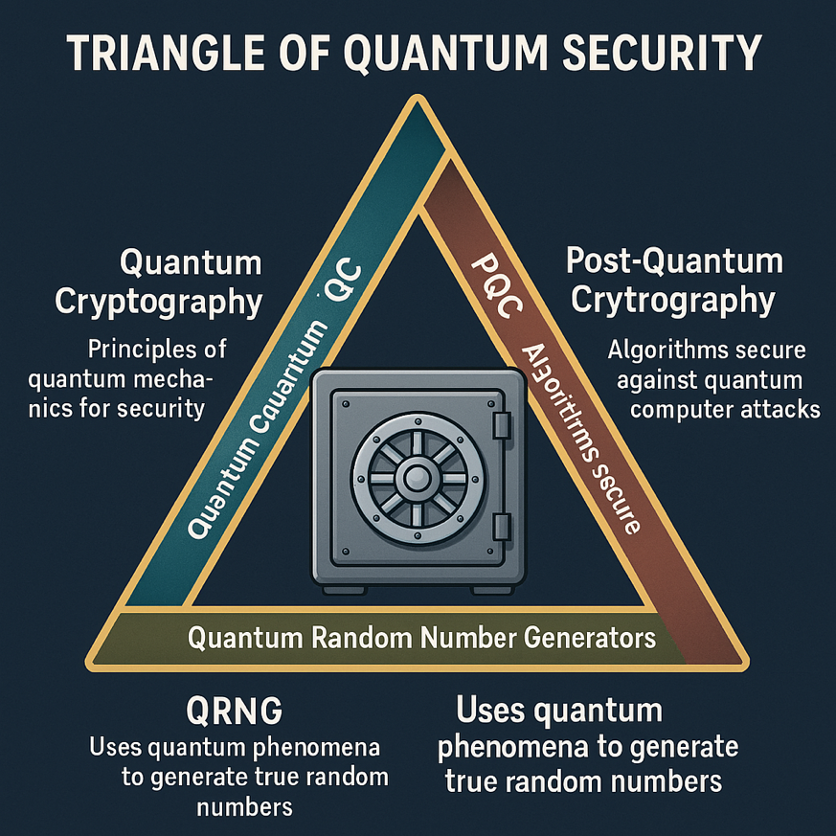

# EgQCC Quantum Security Track

## Overview

EgQCC Quantum Security Track is built on three main defenses (the **Quantum Security Triangle**):

1. **PQC (Post-Quantum Cryptography)**: Software-based math that classical computers can run but quantum computers can't easily break
2. **QC (Quantum Communication)**: Quantum Communication refers to hardware-based security mechanisms such as QKD, QSDC, and emerging quantum authentication methods.
3. **QRNG (Quantum Random Number Generators)**: Using quantum unpredictability to create high-quality (near-ideal) entropy for all encryption keys.

### Security Triangle Comparison

| Security Dimension             | Quantum Communication (QC)                                                                     | Post-Quantum Cryptography (PQC)                                                                        | Quantum Random Number Generators (QRNG)                                                         |
| ------------------------------ | --------------------------------------------------------------------------------------------- | ------------------------------------------------------------------------------------------------------ | ----------------------------------------------------------------------------------------------- |
| **Principle**            | Uses quantum physics principles to achieve information-theoretic security under ideal implementations          | Develops algorithms secure against quantum computer attacks                                            | Uses quantum phenomena to generate true random numbers                                          |
| **Technology**           | Requires quantum hardware (e.g.,**QKD systems**)                                        | Can be implemented on**classical computers**                                                     | Based on quantum mechanical processes (e.g.,**photon behavior**)                          |
| **Examples**             | Quantum Key Distribution (**QKD**) like BB84, E91, … etc.                              | Lattice-based (Kyber, Dilithium), Code-based (McEliece), Hash-based (SPHINCS+)                         | Devices generating**true randomness** from quantum states of particles                    |
| **Example (Bank Vault)** | Super secure**one-time delivery** of the combination code (**key**) for the vault | Replacing the existing lock on the**vault** with a new, **resistant to quantum computers** | Generating**true random numbers** for the combination code (**keys**) using photons |
| **Security Guarantee** | Information-Theoretic (ideal implementations) | Computational | Information-Theoretic |

### The Five Phases of the Track

**Phase 1: Quantum Foundation & Strategy & Enterprise Migration (QRA)**

- Understand the physics of quantum mechanics (No-Cloning, Entanglement, Uncertainty Principle)
- Learn how quantum computers break classical cryptography (Shor's & Grover's Algorithms)
- Calculate organizational risk exposure using Mosca's Theorem ($X+Y > Z$)
- Start building your Cryptographic Bill of Materials (CBOM)

**Phase 2: Post-Quantum Cryptography (PQC) – The Algorithmic Layer**

- Master the finalized NIST 2024/2025 standards (ML-KEM, ML-DSA, SLH-DSA)
- Learn the HQC backup standard for lattice-based algorithm resilience
- Implement hybrid encryption models to ensure backward compatibility
- Write your first PQC-enabled applications using liboqs

**Phase 3: Quantum Communication (QC) – The Physical Layer**

- Study Quantum Key Distribution (QKD) protocols like BB84
- Understand Quantum Temporal Authentication (QTA) for identity verification
- Learn Quantum Secure Direct Communication (QSDC) for data transmission
- Simulate quantum networks with NetSquid and QuNetSim

**Phase 4: QRNG (Quantum Random Number Generators)**

- Explore quantum entropy sources (photon beam splitting, vacuum fluctuations)
- Comply with ISO/IEC 23837 and NIST SP 800-90B/C standards
- Integrate QRNG for seeding cryptographic keys and authentication challenges
- Certify quantum randomness quality for enterprise use

**Phase 5: Strategy & Enterprise Migration (QRA)**

- Discover hidden cryptography in legacy systems using automated scanners
- Prioritize migration efforts for "Harvest Now, Decrypt Later" (HNDL) threats
- Simulate network transitions with real-world timing considerations
- Lead organizational quantum-safe readiness initiatives

---

## Course Phases at a Glance

| Phase | Level                                                              | Focus Areas                                                                                                                                                                            | # Sessions | Instructors |
| ----- | ------------------------------------------------------------------ | -------------------------------------------------------------------------------------------------------------------------------------------------------------------------------------- | ---------- | ----------- |
| 1     | **Quantum Foundation**                                       | Linear algebra, superposition, and why RSA/ECC are at risk (Shor's Algorithm), QBER, Bell state. Using Mosca's Theorem ($X+Y > Z$) and understanding quantum mechanics fundamentals. | 1          | SZ, RN, MH  |
| 2     | **Post-Quantum Cryptography (PQC) – The Algorithmic Layer** | Learning the new NIST Standards (ML-KEM, ML-DSA, SLH-DSA) and the HQC backup, using testing libraries like liboqs. Hybrid implementation strategies.                                   | 1          | SZ, RN, MH  |
| 3     | **Quantum Communication (QC) – The Physical Layer**         | Understanding QKD (key sharing), QTA (identity), and QSDC (direct data). Simulating with NetSquid or QuNetSim                                                                          | 1          | SZ          |
| 4     | **QRNG (Quantum Random Number Generators)**                  | Using quantum unpredictability to create "perfect" entropy for all encryption keys. ISO/IEC 23837 and NIST SP 800-90B/C compliance.                                                    | 1          | SZ, RN      |
| 5     | **Strategy & Enterprise Migration (QRA)**                    | Building Cryptographic Bill of Materials (CBOM), risk assessment (HNDL threats), and practical migration strategies. Leading organizational quantum-safe readiness.                    | 1          | SZ, RN, MH  |

---

## Phase 1: Quantum Foundation

**Focus**: Understanding the physics of the solution and the math of the threat.

### 1. Quantum Mechanics for Security:

- **No-Cloning Theorem**: Why quantum states (photons) cannot be copied, making QC physically unhackable.
- **Entanglement & Bell's Theorem**: Understanding the "spooky action" that powers E91 (Entanglement QKD).
- **Heisenberg's Uncertainty Principle**: How the act of measuring a signal changes it (Eavesdropping Detection).

### 2. The Classical Failure (The Math):

- **Shor's Algorithm**: Deep dive into how it breaks RSA/ECC via Period Finding.
- **Grover's Algorithm**: Why AES-128 is "halved" in security and why AES-256 is the minimum quantum-safe symmetric standard.
- **Mosca's Theorem** ($X+Y > Z$): Learning to calculate if your data will be exposed before you can migrate.

### 3. Introduction to Enterprise Risk:

- **Initial CBOM Concepts**: Overview of Cryptographic Bill of Materials for later deep-dive in Phase 5.
- **QBER and Quantum Bit Errors**: Fundamentals of quantum error detection mechanisms.

---

## Phase 2: Quantum Communication (QC) – The Physical Layer

**Focus**: Identity and data security via hardware and light.

### 1. Quantum Key Distribution (QKD):

- **BB84 Protocol**: "Prepare and Measure" mechanics.
- **Quantum Bit Error Rate (QBER)**: Learning to monitor noise levels to detect intruders in real-time.
- **Privacy Amplification**: Post-processing techniques to "clean" a shared key.

### 2. Quantum Temporal Authentication (QTA):

- **Temporal Binding**: Using nanosecond-scale "Time-of-Arrival" (ToA) to ensure a signal is from a physical location, preventing Man-in-the-Middle (MITM) and Replay Attacks.
- **Verification Challenges**: Implementing time-based challenges that a quantum-cloner cannot mimic due to processing delays.

### 3. Quantum Secure Direct Communication (QSDC):

- **No-Key Encryption**: Sending data directly over the quantum channel without a prior key.
- **The Security Checking Phase**: How to verify a channel is safe before sending the bulk of the information.

---

## Phase 3: Post-Quantum Cryptography (PQC) – The Algorithmic Layer

**Focus**: Finalized NIST 2024/2025 Standards.

### 1. The New NIST Standards (Finalized Aug 2024):

- **FIPS 203 (ML-KEM)**: Formerly Kyber. The new global standard for general encryption and key encapsulation.
- **FIPS 204 (ML-DSA)**: Formerly Dilithium. The primary standard for digital signatures (identity).
- **FIPS 205 (SLH-DSA)**: Formerly SPHINCS+. The "Stateless Hash" backup for signatures.

### 2. The 2025 "Backup" Standards:

- **HQC (Hamming Quasi-Cyclic)**: Finalized in March 2025 as the primary code-based backup if Lattice-based math (ML-KEM) is ever broken.

### 3. Hybrid Implementation (ETSI TS 104 015):

- Learning the "Dual Signature" and "Hybrid Key Exchange" models. This ensures if a quantum algorithm fails, your old classical encryption still acts as a safety net.

---

## Phase 4: QRNG (Quantum Random Number Generators)

**Focus**: Perfect entropy as the root of all security.

### 1. Quantum Entropy Sources:

- **Optical (Photon Beam Splitting)**: Using the 50/50 probability of a photon passing through a mirror.
- **Vacuum Fluctuations**: Measuring quantum noise for high-speed randomness.

### 2. Standards & Certification:

- **ISO/IEC 23837**: The 2023/2024 standard for testing and certifying QRNG modules.
- **NIST SP 800-90B/C**: Compliance for entropy health-testing.

### 3. Integration:

- Using QRNG to seed PQC keys and provide the high-speed challenges required for QTA.

---

## Phase 5: Strategy & Enterprise Migration (QRA)

**Focus**: Leading the transition for a business or government.

### 1. Discovery (CBOM):

- Building a Cryptographic Bill of Materials (CBOM). You cannot fix what you cannot find.
- Tools: Using automated scanners to find where RSA/ECC are hidden in old codebases.

### 2. Risk Assessment:

- **Priority 1**: "Harvest Now, Decrypt Later" (HNDL) data—data that must stay secret for 10+ years (Health, Defense).
- **Priority 2**: Digital Signatures/PKI (Identity).

### 3. Practical Simulation:

- **NetSquid**: For simulating QTA and QSDC network timing.
- **liboqs (Open Quantum Safe)**: Writing your first PQC-enabled Python or C++ application.

---

## Recommended Tech Stack for Learners

**Coding:**

- Python (with numpy for math)
- C (for liboqs)

**Simulators:**

- QuNetSim (Quantum Networks)
- IBM Qiskit (Circuit Logic)

**Monitoring:**

- Zeek or Wireshark (to see how PQC changes packet sizes in real traffic)

---

## Getting Started

Each phase includes hands-on labs, simulations, and real-world implementations. Explore the folders in this repository for phase-specific materials, code samples, and testing frameworks.

For questions or contributions, reach out to the instructors: SZ, RN, MH.
