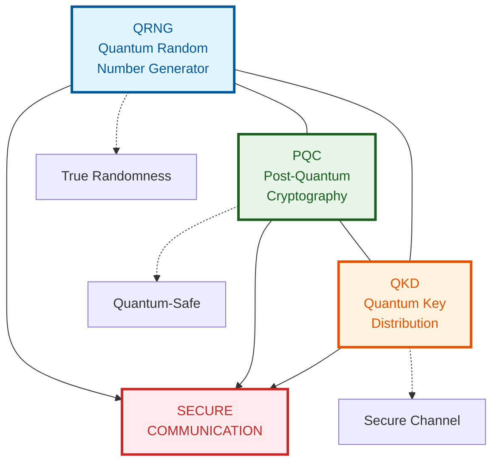
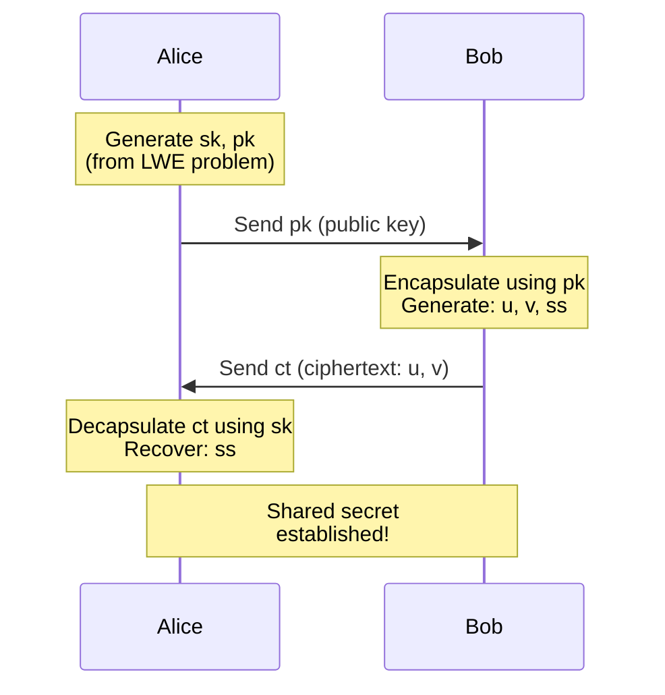
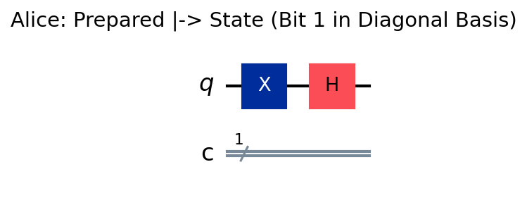
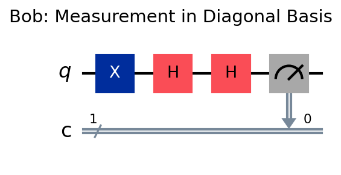
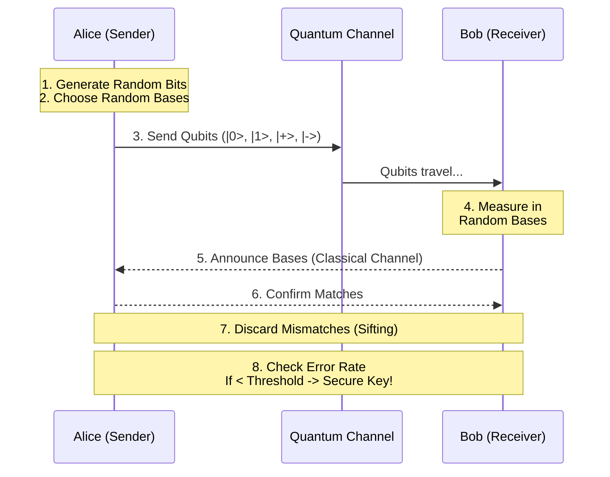

# 🔐 Triangle of Quantum Security

## Overview
This project demonstrates the **Triangle of Quantum Security**, a holistic approach to next-generation cryptography that integrates three critical technologies:

1.  **QRNG (Quantum Random Number Generator)**: Generates truly random keys using quantum mechanics (superposition and measurement).
2.  **PQC (Post-Quantum Cryptography)**: Protects data against future quantum computer attacks using mathematical complexity (Lattice-based cryptography).
3.  **QC (Quantum Communication / QKD)**: Ensures secure key distribution through the laws of physics (BB84 protocol).

## 🚀 Features
*   **True Randomness**: Implementation of a quantum circuit using Hadamard gates to generate unbiased random numbers.
*   **Quantum-Safe Encryption**: Simplified demonstration of Kyber-like Key Encapsulation Mechanism (KEM) based on the Learning With Errors (LWE) problem.
*   **Unbreakable Keys**: Simulation of the BB84 Quantum Key Distribution protocol with eavesdropper detection.
*   **Interactive Visualizations**:
    *   Quantum Circuit diagrams (Qiskit)
    *   Process flows and architecture diagrams (Mermaid)
    *   Statistical analysis plots (Matplotlib)

## 📊 Visualizations and Analysis

### 1. Unified Architecture


**Analysis**: The "Triangle" architecture combines three layers of defense.
*   **QRNG** is the foundation, providing the entropy (randomness) needed for strong keys.
*   **PQC** provides the mathematical algorithmic layer, protecting data even if intercepted and stored for future quantum decryption ("harvest now, decrypt later").
*   **QKD** adds the physical layer security, ensuring that any attempt to eavesdrop on the key exchange is detected by the laws of quantum mechanics (No-Cloning Theorem).

### 2. Quantum Random Number Generator (QRNG)
The process of generating true randomness using quantum superposition.



**Circuit Logic**: The circuit utilizes 8 qubits initialized to |0⟩. A Hadamard gate (H) is applied to each, creating a superposition state (|0⟩ + |1⟩)/√2. Measurement collapses this state to a purely random bit (0 or 1).
**Statistical Analysis**:

The distribution of generated numbers (0-255) typically shows a uniform distribution, confirming high entropy compared to pseudo-random generators which can exhibit patterns.

### 3. Post-Quantum Cryptography (PQC) Security
The Key Encapsulation Mechanism (KEM) used to secure keys against quantum computers.


**Performance**: The Kyber-like Lattice KEM demonstrates that while key sizes are larger than traditional RSA/ECC, the encapsulation and decapsulation times remain efficient for practical use. The security relies on the "Module Learning With Errors" (M-LWE) problem, which is believed to be hard even for quantum computers.

### 4. Quantum Key Distribution (QKD)
The BB84 protocol for detecting eavesdroppers during key transmission.

#### Circuit Implementation (BB84)
**1. Alice's Preparation Phase:**

*Alice encodes a bit (e.g., 1) into a superposition state using a Hadamard gate.*

**2. Bob's Measurement Phase:**

*Bob applies his random basis choice (e.g., Hadamard) before measurement.*

#### Protocol Flow



**BB84 Protocol**: The visualization traces the flow of qubits between Alice and Bob.
*   **Eavesdropping Detection**: If an eavesdropper (Eve) intercepts the qubits, the error rate in the final key rises significantly (theoretically 25% for simple attacks).
*   **Secure Channel**: In the absence of Eve, the error rate remains near 0%, allowing Alice and Bob to distill a secure shared secret.

## 📈 Sample Runtime Data
*From a recent execution of the full simulation workflow:*

### Step 1: QRNG Output
*   **Generated Key (Hex)**: `d475efbc8d75cd6ae15515624f1ee8cf201add521bf4828ee023ca3327169b73`
*   **Size**: 256 bits (32 bytes)
*   **Entropy Source**: 8-qubit Quantum Circuit (Simulated)

### Step 2: PQC Encryption (Kyber-Lite)
*   **Shared Secret A (Bob)**: `2c5cbeb369bc7a5022524dd02b8afdac...`
*   **Shared Secret B (Alice)**: `f5a2513e4ec0a2dbf094c5d8ee7723b7...`
*   **Key Agreement Status**: **SUCCESS** (Secrets match)

### Step 3: QKD Transmission (BB84)
*   **Total Qubits Sent**: 100
*   **Basis Match Rate**: ~58% (Expected ~50%)
*   **Sifted Key Length**: 58 bits
*   **Detected Error Rate**: **0.00%** (No eavesdropper)
*   **Final Key**: `74e499f4`

## 🛠️ Tech Stack & Requirements
*   **Python 3.8+**
*   **Qiskit**: For quantum circuit simulation.
*   **NumPy**: For numerical operations and polynomial arithmetic.
*   **Matplotlib**: For plotting randomness distribution and signal analysis.
*   **Mermaid**: For architectural flowcharts and sequence diagrams.

## 📖 How to Run
1.  Clone the repository.
2.  Install the required dependencies:
    ```bash
    pip install qiskit qiskit-aer numpy matplotlib jupyterlab
    ```
3.  Open the notebook:
    ```bash
    jupyter notebook triangle_of_quantum_security.ipynb
    ```
4.  Run all cells to see the simulations and visualizations in action.

---
*Created as part of the EgQCC-QC Track.*
